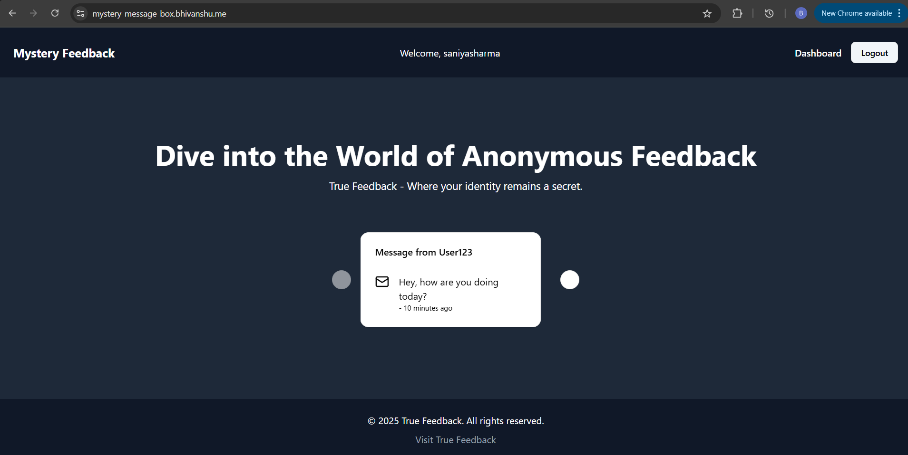
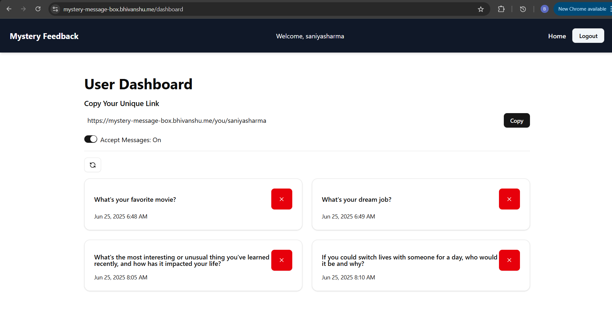

# 📦 Mystery Message Box

Welcome to **Mystery Message Box**, a fun and interactive platform where users can send and receive anonymous messages. Get real, raw, and unfiltered feedback from your friends, colleagues, or secret admirers without revealing their identity.

**🔗 Live Demo:** [https://mystery-message-box.bhivanshu.me](https://mystery-message-box.bhivanshu.me)

---

## 🚀 Features

- 🔐 **Secure Authentication with NextAuth**  
  Login with unique credentials to access your private message box.

- 💬 **Anonymous Messaging**  
  Receive messages from anyone without knowing their identity.

- 📜 **Message Dashboard**  
  View all received messages in a clean, user-friendly dashboard.

- 📱 **Responsive UI**  
  Fully optimized for mobile, tablet, and desktop.

- 🕐 **Real-Time Updates (Planned)**  
  Future support for live message updates.

---

## 📸 Screenshots

| Landing Page | Dashboard |
|--------------|-----------|
|  |  |

---

## 🛠️ Tech Stack

- **Frontend:** Next.js, TypeScript, CSS
- **Backend:** Next.js API Routes
- **Database:** MongoDB (or your database service)
- **Authentication:** Session-based login

---

## ⚙️ Setup Instructions

### Prerequisites
- Node.js (v18+ recommended)
- npm or yarn
- MongoDB Database

### Installation
```bash
git clone https://github.com/Bhivanshu45/Mystery_Message_Box.git
cd Mystery_Message_Box
npm install

Environment Variables
Create a .env.local file in the root directory and add the following:

env
Copy code
MONGODB_URI=your_database_url
NEXTAUTH_SECRET=your_secret_key
RESEND_API_KEY=your_api_key
GROQ_API_KEY=your_api_key
(Add any other environment variables you're using.)

Run the Development Server
bash
Copy code
npm run dev
Open http://localhost:3000 to see the app.

🚀 Deployment
This project is deployed on Vercel.
Live Site: https://mystery-message-box.bhivanshu.me

🤝 Connect with Me
Bhivanshu Lawaniya

GitHub: @Bhivanshu45

Email: bhivanshulawaniya@gmail.com